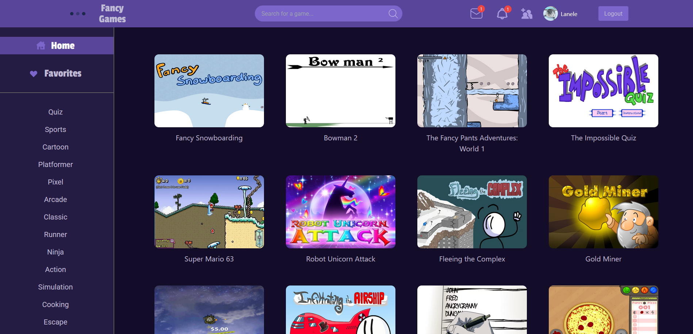
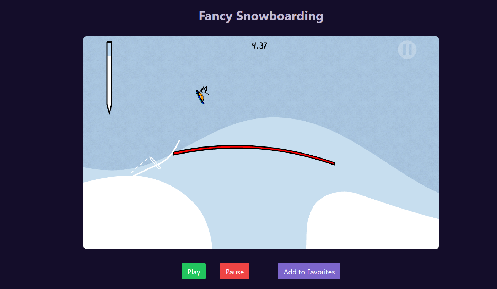
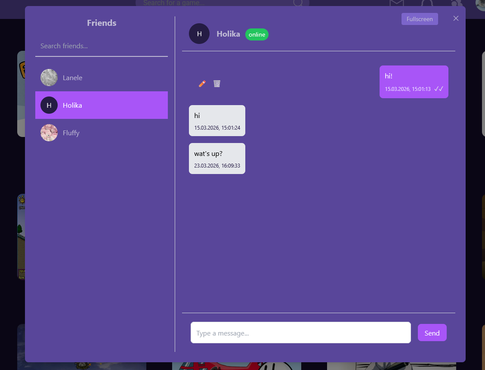

# 🎮 Flash Games Platform

Full-stack web app with a flash games library, social features, and real-time messaging.

## 🔗 Links

🌐 App: https://flash-online.vercel.app  

## ✨ Features

- Browse and play Flash games using Ruffle (Flash emulator)  
- Search games, filter by genre, and save favorites  
- Admin-only game management  
- Leave comments on game pages  
- Add friends and send private messages  
- Real-time chats with Socket.IO  
- Infinite scroll and read/unread tracking in conversations  
- Edit and delete messages  
- See which friends are online  
- Real-time notifications  
- Automatic sync of unread messages and notifications on reconnect  
- Messages are persisted and can be exchanged via HTTP and WebSockets  

## ⚙️ Tech Stack

**Frontend**
- React (TypeScript)  
- Redux Toolkit + RTK Query  
- Axios  
- Socket.IO  
- Tailwind CSS  

**Backend**
- Node.js + Express  
- PostgreSQL (Neon)  
- Sequelize  
- JWT  
- Socket.IO  

**Deployment**
- Frontend: Vercel  
- Backend: Fly.io  

## 🚀 Run locally

```bash
git clone https://github.com/Flanele/flash_online.git
cd flash_online
cd server && npm install
cd ../client && npm install
```

Set up environment variables:

```bash
cp server/.env.example server/.env
```

Run backend (terminal 1):

```bash
cd server
npm run dev
```

Run frontend (terminal 2):

```bash
cd client
npm run dev
```

## 📸 Preview

  
  
  


